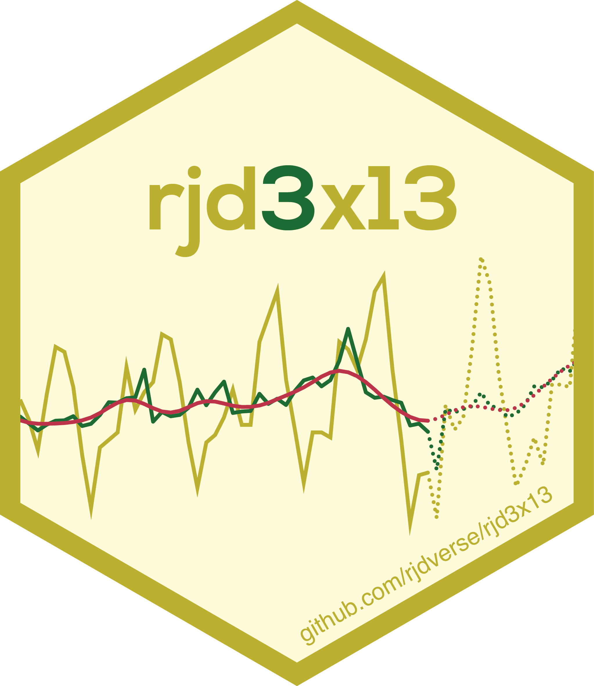

<!-- README.md is generated from README.Rmd. Please edit that file -->

```{r, echo = FALSE, include=FALSE}
knitr::opts_chunk$set(
    collapse = TRUE,
    comment = "#>",
    fig.path = "man/figures/README-",
    fig.align = "center",
    fig.width = 8L
)
library("rjd3x13")
```

# `rjd3x13` <a href="https://rjdverse.github.io/rjd3x13/"></a>

<!-- badges: start -->
[](https://CRAN.R-project.org/package=rjd3x13)

[](https://github.com/rjdverse/rjd3x13/actions/workflows/R-CMD-check.yaml)
[](https://github.com/rjdverse/rjd3x13/actions/workflows/lint.yaml)

[](https://github.com/rjdverse/rjd3x13/actions/workflows/pkgdown.yaml)
<!-- badges: end -->


rjd3x13 offers full access to options and outputs of X-13 (`rjd3x13::x13()`), including RegARIMA modelling (`rjd3x13::regarima()`) and X-11 decomposition (`rjd3x13::x11()`).

A specification can be created with `rjd3x13::regarima_spec()`, `rjd3x13::x11_spec()` or `rjd3x13::x13_spec()` and can be modified with the following functions:

- for pre-processing: `rjd3toolkit::set_arima()`, `rjd3toolkit::set_automodel()`, `rjd3toolkit::set_basic()`, `rjd3toolkit::set_easter()`, `rjd3toolkit::set_estimate()`, `rjd3toolkit::set_outlier()`, `rjd3toolkit::set_tradingdays()`, `rjd3toolkit::set_transform()`, `rjd3toolkit::add_outlier()`, `rjd3toolkit::remove_outlier()`, `rjd3toolkit::add_ramp()`, `rjd3toolkit::remove_ramp()`, `rjd3toolkit::add_usrdefvar()`;

- for decomposition: `rjd3x13::set_x11()`;

- for benchmarking: `rjd3toolkit::set_benchmarking()`.
 

## Installation

Running rjd3 packages requires **Java 17 or higher**. How to set up such a configuration in R is explained [here](https://jdemetra-new-documentation.netlify.app/#Rconfig)  


### Latest release

To get the current stable version (from the latest release):

- From GitHub:

```{r, echo = TRUE, eval = FALSE}
# install.packages("remotes")
remotes::install_github("rjdverse/rjd3toolkit@*release")
remotes::install_github("rjdverse/rjd3x13@*release")
```

- From [r-universe](https://rjdverse.r-universe.dev/rjd3x13):

```{r, echo = TRUE, eval = FALSE}
install.packages("rjd3x13", repos = c("https://rjdverse.r-universe.dev", "https://cloud.r-project.org"))
```

### Development version

You can install the development version of **rjd3x13** from [GitHub](https://github.com/) with:

```{r, echo = TRUE, eval = FALSE}
# install.packages("remotes")
remotes::install_github("rjdverse/rjd3x13")
```


## Usage

```{r x-13-final}
library("rjd3x13")

y <- rjd3toolkit::ABS$X0.2.09.10.M
x13_model <- x13(y)
summary(x13_model$result$preprocessing) # Summary of regarima model

plot(x13_model) # Plot of the final decomposition
```


## Package Maintenance and contributing

Any contribution is welcome and should be done through pull requests and/or issues.
pull requests should include **updated tests** and **updated documentation**. If functionality is changed, docstrings should be added or updated.


## Licensing

The code of this project is licensed under the [European Union Public Licence (EUPL)](https://joinup.ec.europa.eu/collection/eupl/eupl-text-eupl-12).
